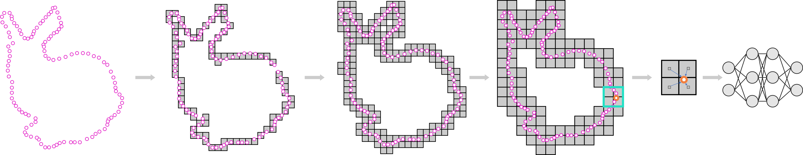

# Interpolation-Aware Padding for 3D Sparse Convolutional Neural Networks
Created by <a href="https://yukichiii.github.io/" target="_blank">Yu-Qi Yang</a>, <a href="https://wang-ps.github.io/" target="_blank">Peng-Shuai Wang</a> and <a href="https://xueyuhanlang.github.io/" target="_blank">Yang Liu</a>.

## Introduction
This repository is code release for our paper (arXiv report [here](https://arxiv.org/abs/2108.06925)).

Sparse voxel-based 3D convolutional neural networks (CNNs) are widely used for various 3D vision tasks. Sparse voxel-based 3D CNNs create sparse non-empty voxels from the 3D input and perform 3D convolution operations on them only. We propose a simple yet effective padding scheme --- interpolation-aware padding to pad a few empty voxels adjacent to the non-empty voxels and involve them in the 3D CNN computation so that all neighboring voxels exist when computing point-wise features via the trilinear interpolation. For fine-grained 3D vision tasks where point-wise features are essential, like semantic segmentation and 3D detection, our network achieves higher prediction accuracy than the existing networks using the nearest neighbor interpolation or the normalized trilinear interpolation with the zero-padding or the octree-padding scheme. Through extensive comparisons on various 3D segmentation and detection tasks, we demonstrate the superiority of 3D sparse CNNs with our padding scheme in conjunction with feature interpolation.

## Environment
Our Experiments are based on torch_sparse, it is a re-implementation of MinkowskiEngine. It use Google's sparse hash map project to accelerate the sparse operations. So we choose this library as our tool.

We test our code in an environment with PyTorch1.7 + CUDA10.1.

All the libraries we used for experiments are third-party open-source codes.

You can create the environment following this:

    conda create --name padding python=3.7 -y
    conda activate padding
    conda install pytorch==1.7.1 torchvision==0.8.2 torchaudio==0.7.2 cudatoolkit=10.1 -c pytorch -y

    sudo apt-get install libsparsehash-dev
    pip install git+https://github.com/mit-han-lab/torchsparse.git@v1.1.0

Or you can use our docker with configured environments through:

    docker pull yyq465009551/sparse_padding:latest

The core code of our padding methods is shown in `pad_voxel_for_ti.py`, and the normalized trilinear interpolation is implemented in `mink_utils.py`. You can use it as a plug-in in any frameworks based on sparse 3D CNNs. You can follow the usage in our experiments below.

## Experiments
### Semantic Segmentation Task
For Semantic Segmentation Task on SemanticKITTI and ScanNet, we use the code from SPVNAS. To use the code, you should first clone from the original repo.

    git clone https://github.com/mit-han-lab/spvnas.git
    cd spvnas
    git checkout d58b12877d73f812b3f0b99ee77b72c4aad7e8da

Then add our plug-in code and some modification for some arguments of training. You can replace the code with which in `spvnas_patch`.

    cp -a spvnas_patch/. spvnas
    cd spvnas/spvnas

To preprocess the SemanticKITTI dataset,
- Follow the instructions from [here](http://www.semantic-kitti.org) to download the SemanticKITTI dataset
- Extract all the files in the `sequences` folder
- Replace keywords `path_to_kitti_dataset` in the `spvnas/spvnas/configs/semantic_kitti/default.yaml` with the path you extract the sequences, like `/mnt/data/SemanticKITTI/dataset/sequences`

Then you can train the network which extract features from the voxel at 20cm resolution with interpolation-aware padding and trilinear interpolation through commands:

    torchpack dist-run -v -np 4 python train.py configs/semantic_kitti/minkunet_low_2/minkunet_20cm_out_tri_pad.yaml --run-dir logs/kitti_logs/minkunet_20cm_out_tri_pad

|                               |    Pad   |    Int   |   Sout   |     mIoU       |
| :---------------------------  | :------: | :------: | :------: | :------------: |
| `SemanticKITTI_val_MinkUNet`  |   ZERO   |   NEAR   |   5cm    |   61.9 ± 0.3   |
| `SemanticKITTI_val_MinkUNet`  |   ZERO   |   NEAR   |   20cm   |   61.5 ± 0.3   |
| `SemanticKITTI_val_MinkUNet`  |  INTERP  |  LINEAR  |   20cm   |   63.9 ± 0.4   |

To preprocess the ScanNet dataset,
- Follow the instructions from [here](http://kaldir.vc.in.tum.de/scannet_benchmark/documentation) to download the ScanNet dataset
- Preprocess the dataset with this [script here](https://github.com/chrischoy/SpatioTemporalSegmentation/blob/master/lib/datasets/preprocessing/scannet.py).
- Replace keywords `path_to_scannet_dataset` in the `spvnas/spvnas/configs/scannet/default.yaml` with the path to the processed data, like `/mnt/data/scans_processed`

Then you can train the network which extract features from the voxel at 8cm resolution through commands:

    torchpack dist-run -v -np 4 python train.py configs/scannet/minkunet_low_2/default_pad_point.yaml --run-dir logs/scannet_logs/minkunet_8cm_out_tri_pad

### Object Detection Task
For Object Detection Task On ScanNet, we use VoteNet and H3DNet as our baseline. First, you should clone the code of VoteNet and H3DNet.
For VoteNet:

    git clone https://github.com/facebookresearch/votenet.git

Prepare the boundingbox data of ScanNet and install the Python dependencies by following `votenet/README.md` and `H3DNet/README.md`. The processed data should be in this folder `votenet/scannet/scannet_train_detection_data` and `H3DNet/scannet/scannet_train_detection_data`.

To train the detection network which uses sparse 3D CNN backbone with our padding scheme, you should copy the code of our modified model to the cloned repo.

    cp -a votenet_patch/. votenet

Then compile pointnet++ used by both VoteNet and H3DNet.

    cd VoteNet/pointnet2
    python setup.py install

To train the model with our interpolation-aware padding and trilinear interpolation:

    python train_fixed.py --dataset scannet --log_dir logs/scannet_detection_minkunet_points_pad --num_point 40000 --use_color --model votenet_mink_unet --weight_decay 0.0001 --pad_voxel_stride 2,4 --pad_voxel_method trilinear --rand_seed 123456789

For H3DNet, it's similar to prepare the code.

    git clone https://github.com/zaiweizhang/H3DNet.git
    cp -a H3DNet_patch/. H3DNet
    cd H3DNet/pointnet2
    python setup.py install

Then you can train the model with:

    python train_1bb_minkunet.py --data_path scannet/scannet_train_detection_data --dataset scannet --log_dir logs/minkunet_pad --num_point 40000 --model hdnet_1bb_minkunet --batch_size 6  --pad_voxel_stride 4 --pad_voxel_method trilinear

|                      |    Pad   |    Int   |    mAP@0.25    |     mAP@0.5    |
| :------------------  | :------: | :------: | :------------: | :------------: |
| `VoteNet_PointNet++` |     -    |     -    |   57.8 ± 0.6   |   34.7 ± 0.4   |
| `VoteNet_Minknet`    |   ZERO   |   NEAR   |   58.7 ± 0.5   |   37.9 ± 0.6   |
| `VoteNet_Minknet`    |  INTERP  |  LINEAR  |   60.7 ± 0.8   |   41.4 ± 0.6   |
| `H3DNet_PointNet++`  |     -    |     -    |   64.0 ± 0.7   |   44.7 ± 0.8   |
| `H3DNet_MinkNet`     |   ZERO   |   NEAR   |   63.6 ± 0.4   |   45.8 ± 0.4   |
| `H3DNet_MinkNet`     |  INTERP  |  LINEAR  |   64.4 ± 0.2   |   47.1 ± 0.3   |